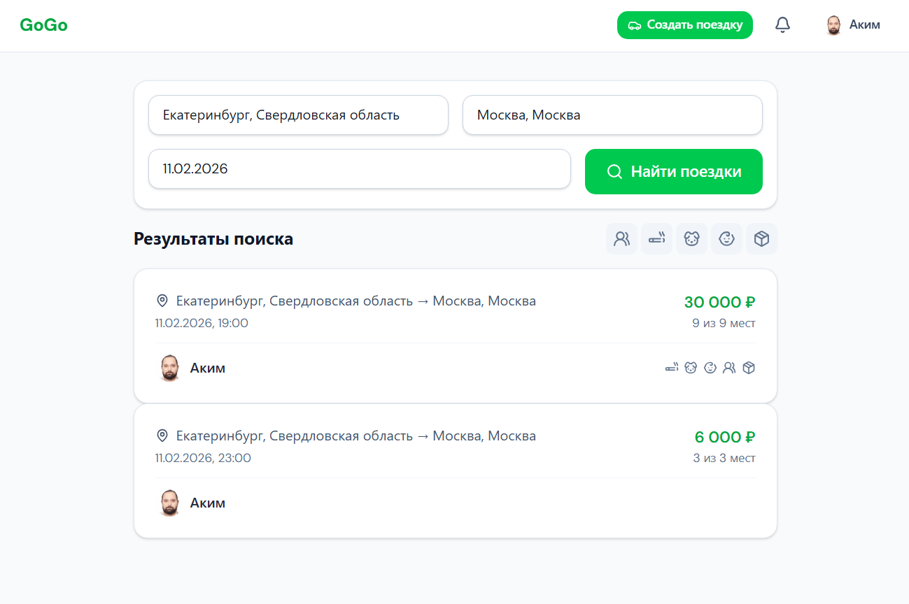
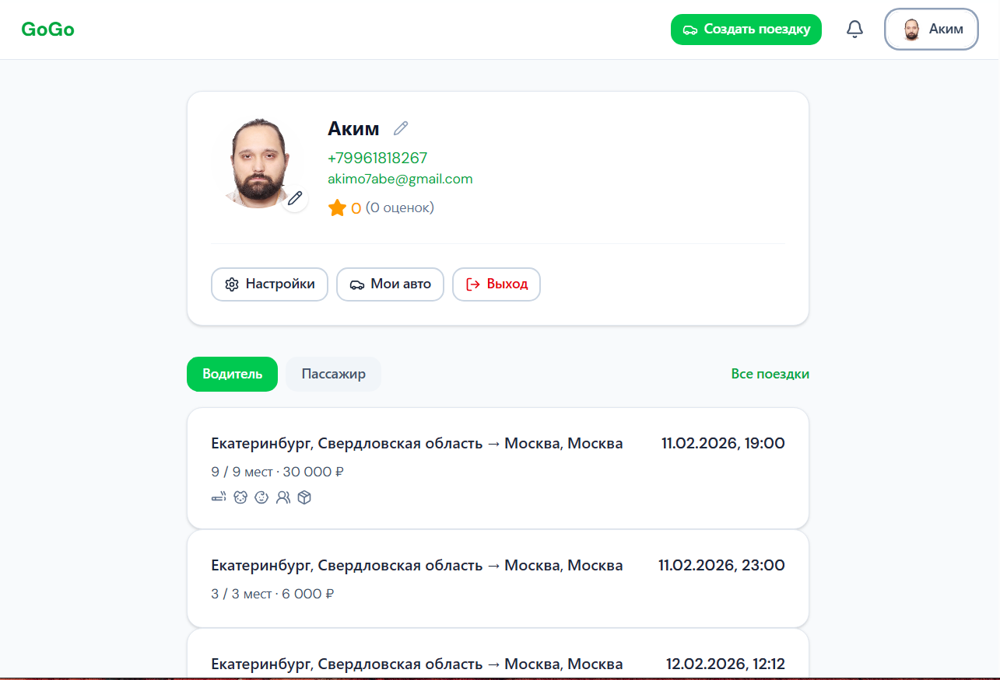
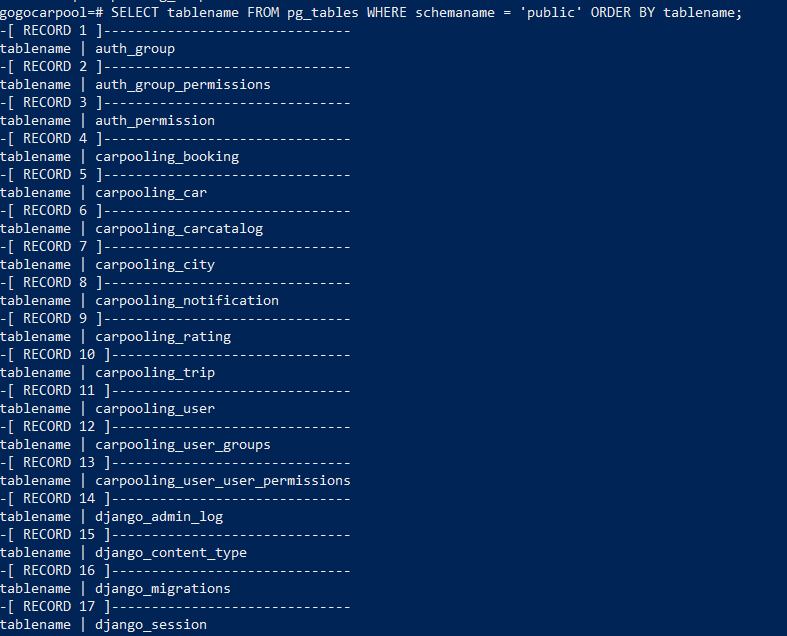

# GoGoCarpool

**GoGoCarpool** — веб-платформа для совместных поездок (карпулинг). Водители публикуют маршруты, пассажиры находят поездки и бронируют места. Реализованы регистрация и авторизация, поиск по маршруту и дате, создание поездок, бронирование, профили пользователей, уведомления и восстановление пароля по почте.

---

## О проекте

Платформа позволяет объединять попутчиков: водитель создаёт поездку с точками отправления и назначения, датой и количеством мест, а пассажиры находят подходящие маршруты и бронируют места. После бронирования водителю предоставляются контакты пассажира, а пассажиру — контакты водителя.

**Основные возможности:**

- Регистрация и вход (JWT), восстановление пароля по email
- Поиск поездок по городам отправления/назначения и дате
- Создание поездок (маршрут, дата, время, количество мест, цена)
- Бронирование мест с отображением водителя и пассажиров
- Профили пользователей (имя, аватар, контакт)
- Уведомления о новых бронированиях
- Адаптивный интерфейс

Серверная часть — REST API на Django (модели, права доступа, пагинация, фильтрация). Фронтенд —   React с маршрутизацией и запросами к API. Письма и уведомления могут отправляться через очередь Celery + Redis или синхронно.

---

## Скриншоты

**Главная страница**


**Страница поиска поездок**



**Профиль пользователя**



**Оценки (отзывы)**


**База данных (консоль)**



---

## Что используется

| Часть | Стек |
|-------|------|
| **Backend** | Python 3.12, Django 6, Django REST Framework, JWT-аутентификация, Celery, Redis, PostgreSQL; используется встроенная **админ-панель Django** |
| **Frontend** | React 19, TypeScript, Vite 7, React Router, Tailwind CSS 4, Lucide React |

**При запуске:** фронтенд (сайт) — **http://localhost:5173/**; бэкенд (API + админка Django) — **http://localhost:8000/** (админка: http://localhost:8000/admin/).

---

## Структура проекта

```
GoGoCarpooling/
├── carpooling/          # Django-приложение (модели, API, задачи)
├── frontend/            # React SPA (Vite)
│   ├── src/
│   │   ├── pages/
│   │   ├── components/
│   │   ├── api/
│   │   └── contexts/
│   └── package.json
├── GoGoCarpool/         # Настройки Django
├── manage.py
└── requirements.txt
```

---

## API

Base URL: `http://localhost:8000/api/`

| Метод | Эндпоинт | Описание |
|-------|----------|----------|
| GET, POST | `/api/auth/` | Регистрация, вход |
| GET | `/api/auth/me/` | Текущий пользователь |
| GET | `/api/trips/` | Список поездок (поиск) |
| GET | `/api/trips/<id>/` | Детали поездки |
| POST | `/api/trips/create/` | Создание поездки |
| GET | `/api/my-trips/` | Мои поездки |
| POST | `/api/trips/<id>/book/` | Бронирование места |
| GET | `/api/my-bookings/` | Мои бронирования |
| GET | `/api/users/<id>/profile/` | Профиль пользователя |
| GET | `/api/cities/`, `/api/cities/autocomplete/` | Города |
| GET, POST | `/api/notifications/` | Уведомления |

---

## Установка (кратко)

1. **Требования:** Python 3.12, Node.js 18+, при необходимости Redis.
2. **Backend:** в корне проекта — `py -3.12 -m venv venv`, активировать venv, `pip install -r requirements.txt`, `python manage.py migrate`.
3. **Frontend:** `cd frontend`, `npm install`.
4. **Секреты:** в корне создать `hiddensettings.env`.

Пример содержимого:

```env
DJANGO_SECRET_KEY=ключ
DJANGO_DEBUG=True
DJANGO_ALLOWED_HOSTS=localhost,127.0.0.1

# Yandex SMTP: пароль — пароль приложения
EMAIL_HOST=smtp.yandex.ru
EMAIL_PORT=587
EMAIL_HOST_USER=email@yandex.com
EMAIL_HOST_PASSWORD=пароль

REDIS_URL=redis://localhost:6379/0
```
5. **Запуск:** Redis (если нужен) → `python manage.py runserver` → в другом терминале `cd frontend && npm run dev`. Сайт: http://localhost:5173/, API: http://127.0.0.1:8000/.

---

### Запуск локально

В корне проекта лежит скрипт **`start-all.ps1`**. Он по очереди открывает четыре окна PowerShell и запускает в них Redis, Django, Frontend и Celery. Запускать из корня проекта:

```powershell
cd C:\Projects\GoGoCarpooling
.\start-all.ps1
```


